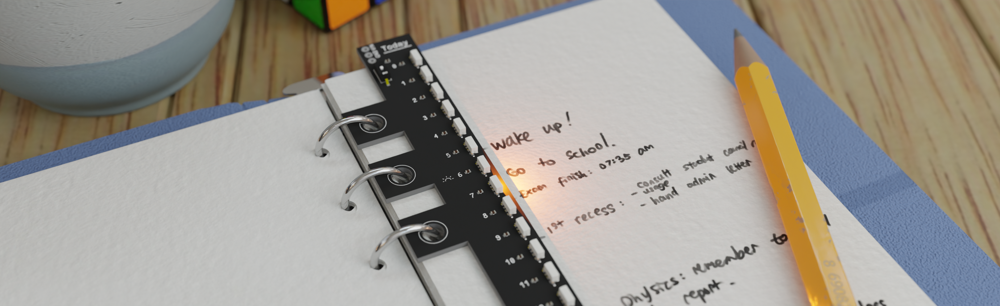
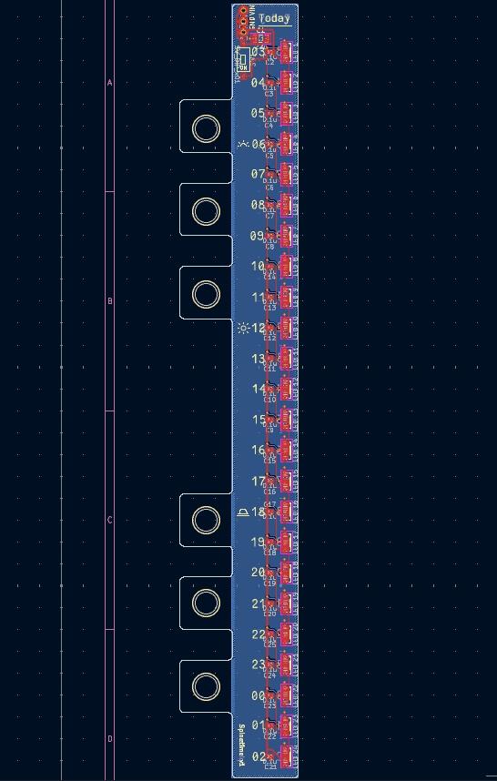
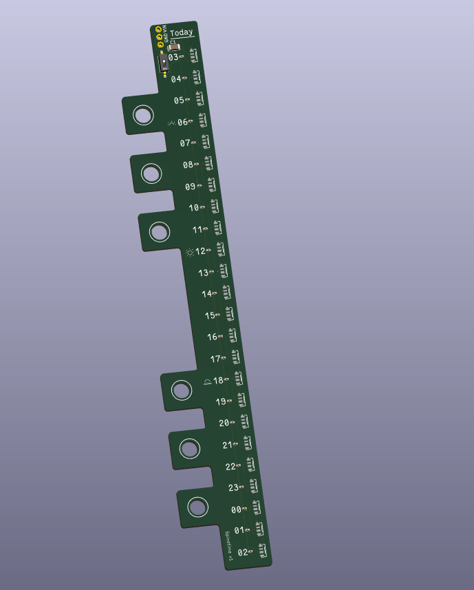
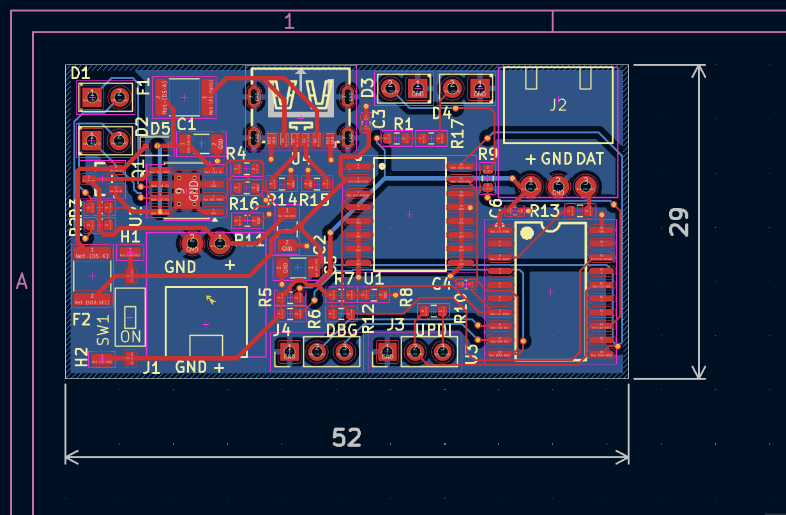
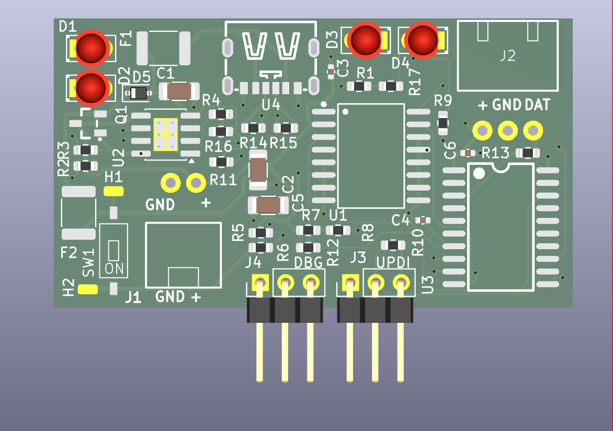
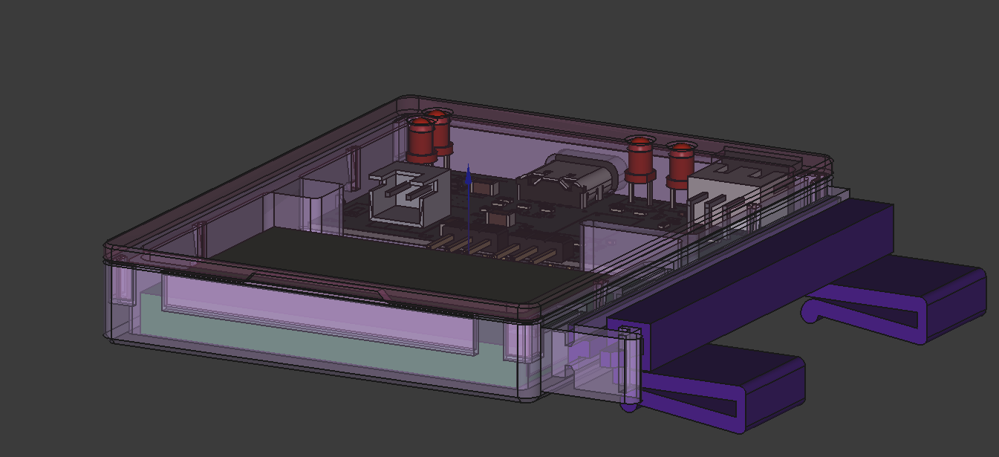
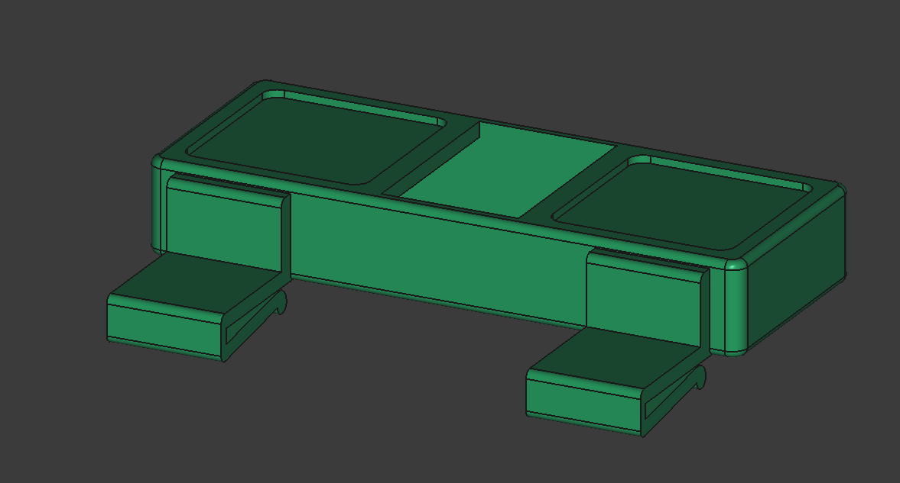

# Spinetime
## TODO
- [ ] upload my custom KiCad footprint & symbol library
- [ ] make BOM and put here

Spinetime is a ring binder-integrated _linear clock [^1]_ designed to help
students and neurodivergent individuals manage time and tasks more effectively.
Users of Spinetime can visualize the passage of the day at a glance, providing
aid especially for those who struggle with time blindness.

## Why?

It is surprising to me that people have manufactured papers with time table
template, but not invent something as simple as a pointer that tells you how far
you have gone through your table. I suspect that this is because most people
aren't time blind, and having some kind of pointer of the table isn't really all
that useful for them. This is simply not the case for those with time blindness:
**time doesn't really mean anything if presented in the wrong way.** I hope that
the proof of concept that came with Spinetime may help present time meaningfully
for those who struggle with time blindness like me.

## Background

As someone who suffers from time blindness on a daily basis, I find managing my
time extremely challenging. It's been intensely hard to picture how I'll spend
my time for a particular day. Having shuffled between multiple time management
methods, I constantly find myself at home when I plan my day out on my physical
journal. I simply love the tactile feel of using a physical tool to plan out my
day.

However, being the visual-oriented person I am, lacking any visual cue of
"where" in the time dimension I am at any given day has been a major
deal-breaker that has kept me from using physical tools for journalling. Of
course, journalling papers with pre-made time tables exist, but they don't tell
me what time it really is right now in any tangible manner relating to the table
itself—what a bummer.

I've been using [ChronoCat](https://chronocat.app/) (not affiliated) to manage
my time lately, and it's been a perfect digital tool—minimalistic,
very visual, and easy to use. It provides the user with a
time table alongside a visual cue of where they are within the day.
However, like I said before, I crave the tactile feel of physical
note-taking. It'd also be great if I can plan my day without the distraction
that comes with using a full-fledged mobile phone or computer.
Plus, being able to plan my day at school would be a great[^2]. I always
dream that one day, I won't forget several of my appointments again.

I looked at my own journalling book again, and thought: _you know, I
think that ChronoCat's approach doesn't have to be in the form of a
digital app._ And so, I came up with SpineTime.

## How to Use

Simply strap Spinetime to your ring binder by opening the spine and inserting
the linear clock component and start annotating your day. This repository hosts
the A6 binder-compatible
version.

## Spelling
Spinetime, SpineTime, spinetime are all valid. No spineTime or spine_time or anything else.
## Project Design Showcase
### PCBs

The actual bookmark ([project files](kicad/bookmark), [.step file](kicad/bookmark/bookmark.step)):

The controller unit ([project files](kicad/controller), [.step file](kicad/controller/controller.step)):

Schematics:

- [Schematic of controller unit](showcase/controller.pdf)
- [Schematic of bookmark unit](showcase/bookmark.pdf)

### 3D Models

The model files can be found under [freecad/](freecad/).

Casing:

Support clip (so your book cover won't wobble when being written on):

### Firmware
The firmware files for SpineTime, `spinetime-fw`, can be [found in this repo](https://github.com/DaringCuteSeal/spinetime-fw).

## BOM
WIP, but it should later consist of PCBA, a li-po battery, and local 3d printing service.
## Credits

Thanks to [Hack Club](https://hackclub.com/) for supporting! Initially made for [Hack Club Blueprint](https://blueprint.hackclub.com), but soon to be transferred to [Hack Club Fallout](https://fallout.hackclub.com/).

**Awesome software used:**
- [KiCad](https://www.kicad.org/) (as EDA)
- [Blender](https://www.blender.org/) (for designing mockup)
- [FreeCAD](https://www.freecad.org/) (as CAD)
- [NeoVim](https://neovim.io/) (as IDE)
- [VSCode](https://code.visualstudio.com/) (as IDE)
- [PlatformIO](https://platformio.org/) (as embedded programming platform)
- [Kitty](https://sw.kovidgoyal.net/kitty/) (as terminal)
- [Git](https://git-scm.com/) (as SVC)
- [Artix Linux!](https://artixlinux.org)

**Awesome services used:**
- [Github](.) (hosting project files)

**I used several 3D models for my PCB 3D model:**
- https://grabcad.com/library/usb-type-c-smd-6pin-1
- https://grabcad.com/library/2-pins-jst-1
- https://grabcad.com/library/3-pins-jst-1

**References (unfortunately not all, just the very notable ones):**
- megaTinyCore, awesome core + documentations for my ATTiny: https://github.com/SpenceKonde/megaTinyCore)
- Datasheet of all components I used. I'm not sure if I wanna include all of the links back because I didn't keep track of them, but feel free to ask for the documents I have locally directly to maybe figure out the source.
- NeoPixel guide: https://learn.adafruit.com/adafruit-neopixel-uberguide/logic-level
- Another NeoPixel guide: https://www.digikey.com/en/maker/projects/adafruit-neopixel-berguide/970445a726c1438a9023c1e78c42e0bb
- How to flash ATtiny1616: https://michael-crum.com/attiny1616/
- Changing clock speed of ATtiny1616: https://www.avrfreaks.net/s/topic/a5C3l000000Ubn4EAC/t159058
- Technical problems with SK6812: https://forums.adafruit.com/viewtopic.php?t=188940
- Sk6812 is hard to solder?: https://www.makerfabs.com/blog/post/how-makerfabs-solve-the-oled-sticking-problem
- Order with moisture-sensitive devices recommendations: https://jlcpcb.com/help/article/moisture-sensitivity-level-msl-for-electronic-parts
- Load-sharing circuit: https://www.thanassis.space/loadsharing.html
- SMD resistor guide: https://www.allpcb.com/blog/pcb-assembly/smd-resistors-demystified-sizes-markings-and-practical-applications.html
- Should LED strip's end be connected to anything?: https://www.reddit.com/r/AskElectronics/comments/1bnx4vv/addressable_led_data_out_connect_to_ground_yn/
- TP4056 breakout reference: https://github.com/alltheworld/tp4056/issues/3
- Setting internal reference voltage for attiny1616: https://forum.arduino.cc/t/how-to-measure-supply-voltage-in-attiny/1244260

Huh, am I over-crediting? maybe..
## LLM Usage Disclosure
I used [ChatGPT](https://chatgpt.com) for sanity-checking my configurations (including my controller schematic, for instance it caught that I didn't pull the CC pins to ground).

[^1]: Analog clock that shows time in a linear format, instead of the usual
12-hour wrap-around style. This clock is often suggested for those with ADHD &
time blindness.

[^2]: My school does not allow the use of mobile phone/laptop during class and
recess.
